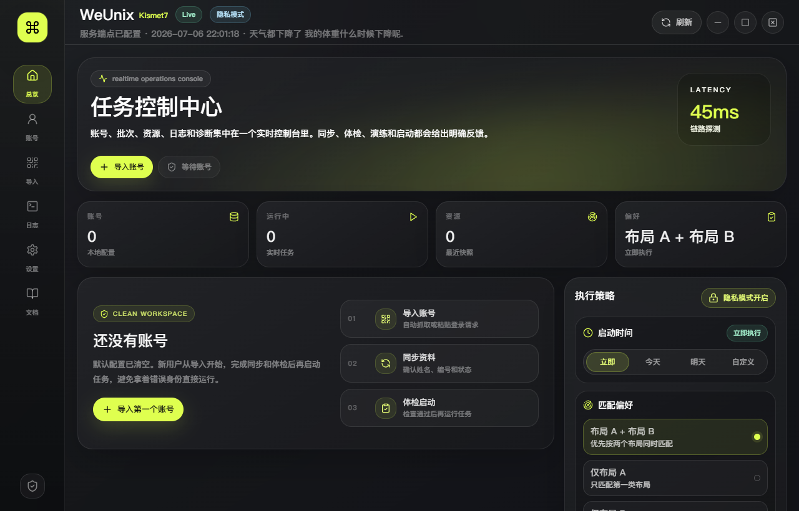

# WeUnix

<p align="center">
  
</p>

<p align="center">
  <strong>一个基于 Tauri、React、TypeScript 与 Python 构建的寝室选择本地桌面控制台。</strong>
</p>

<p align="center">
  <a href="LICENSE"></a>
  
  
  
  
</p>

<p align="center">
  <a href="#-项目简介">项目简介</a>
  ·
  <a href="#-核心能力">核心能力</a>
  ·
  <a href="#-下载安装">下载安装</a>
  ·
  <a href="docs/WeUnix_使用说明书.md">使用说明书</a>
  ·
  <a href="https://github.com/linshiqiyyds/Weunix-JLevcDormroom/releases">GitHub Releases</a>
  ·
  <a href="https://gitee.com/lin-seventeen/Weunix-JLevcDormroom">Gitee 镜像</a>
</p>

> [!IMPORTANT]
> **免责声明 / Notice**
>
> 本项目仅供学习、交流与技术研究使用，不提供任何形式的技术支持、售后支持或可用性承诺。使用者应自行判断使用场景并承担由使用、修改、分发或运行本项目产生的一切风险与后果。项目作者不对任何直接或间接损失、数据问题、账号问题、网络问题、第三方服务限制或其他衍生影响承担责任。
>
> 如本项目内容存在侵权、不当引用、合规争议或其他需要处理的问题，请通过邮箱联系：**Kismetreasure@gmail.com**。我会在收到后尽快核实并处理。

---

## ✨ 项目简介

WeUnix 是一个面向寝室选择流程的本地桌面控制台，用来管理多账号导入、身份信息同步、任务体检、安全演练、正式启动、运行日志和诊断摘要。

它不是一个临时脚本外壳，而是把原本分散在小程序页面、网络请求、配置文件和运行日志里的流程整理成一个更接近正式桌面产品的控制台：有明确的信息层级，有可见的交互反馈，有隐私保护，也有适合普通用户阅读的内置说明。

核心思路是通过本地后端直连关键 API，完成登录态校验、身份同步、批次检查、资源读取和提交前检查，减少对小程序 WebView 页面加载、白屏等待和重复跳转的依赖。按实际使用体验测算，关键流程的体感卡顿可降低约 **82%**；具体效果会受设备性能、网络环境和目标服务状态影响。

项目采用 **Tauri + React + TypeScript** 构建桌面前端，使用 **Python** 承载本地后端和核心流程。默认配置保存在本机，仓库不会提交任何个人账号、运行配置、打包产物或私有字体文件。

## 🧭 适合谁使用

- 想把本地自动化流程做成可视化控制台的人
- 需要同时管理多个账号状态、日志和诊断结果的人
- 遇到小程序长时间白屏、加载慢和跳转卡顿的人
- 想学习 Tauri + React + Python 混合桌面架构的人
- 想参考桌面工具 UI、微交互和发布流程的人
- 希望项目截图放在 README 顶部也足够体面的人

## 🚀 核心能力

| 模块 | 说明 |
| --- | --- |
| 账号导入 | 支持自动捕获和手动粘贴导入，导入后统一进入账号管理流程 |
| 信息同步 | 同步账号身份信息，方便确认当前账号归属 |
| API 直连 | 通过本地后端调用关键接口，减少小程序页面加载、白屏等待和重复跳转 |
| 执行策略 | 支持立即、今天、明天、自定义时间等执行模式 |
| 体检流程 | 检查登录态、Token、身份同步、批次状态、资源返回和偏好匹配 |
| 安全演练 | 在正式启动前模拟关键步骤，降低误操作风险 |
| 任务控制 | 支持单账号和全部账号启动、停止、同步、体检、演练 |
| 订单保护 | 请求到一次真实订单后立即停止继续抢单请求，避免重复提交 |
| 扫码支付 | 成功创建订单后显示支付二维码、支付倒计时、打开链接和复制链接 |
| 实时日志 | 展示运行事件、接口状态和可读错误信息 |
| 隐私模式 | 默认隐藏敏感字段，复制摘要和截图时更安全 |
| 配置备份 | 支持本地配置备份与恢复，降低误删风险 |
| 软件更新 | 支持桌面端检查更新；Gitee 保留源码和更新清单镜像，安装包以 GitHub Release 为准 |
| 内置文档 | 程序内置使用说明，新用户可以按步骤完成操作 |

## 🎨 设计取向

WeUnix 的界面风格参考现代桌面控制台、开发者工具和 SaaS 后台。整体强调清晰的信息层级、克制的色彩、明确的状态反馈和可靠的交互细节。

- 启动页采用轻量 Hello 动画
- 左侧图标导航承载主要页面
- 总览页集中展示任务状态、策略、账号和日志
- 按钮、卡片、输入框、状态标签统一视觉语言
- hover、active、focus、loading、disabled 状态完整覆盖
- 错误提示面向用户表达，不直接暴露杂乱堆栈

## 🧱 技术栈

| 层级 | 技术 |
| --- | --- |
| 桌面壳 | Tauri 2 |
| 前端 | React, TypeScript, Vite |
| 样式 | Tailwind CSS, custom CSS tokens |
| 动效 | Motion for React |
| 背景氛围 | Three.js, React Three Fiber |
| 后端 | Python HTTP API |
| 打包 | Tauri Bundle, PyInstaller |
| 测试 | Python tests, TypeScript build checks |

## 📁 项目结构

```text
Weunix
├─ desktop/
│  ├─ backend_api.py              # 本地后端 API
│  └─ gui/
│     ├─ src/                     # React 前端
│     ├─ src-tauri/               # Tauri 桌面壳
│     └─ package.json
├─ docs/
│  ├─ assets/                     # README 展示图
│  └─ WeUnix_使用说明书.md
├─ tests/                         # Python 测试
├─ weunix_core.py                 # 核心业务流程
├─ room_helpers.py                # 偏好映射和辅助逻辑
├─ config_helpers.py              # 配置读写辅助
├─ secret_store.py                # 本地敏感信息辅助
└─ README.md
```

## 📦 下载安装

普通用户建议从 Releases 下载构建好的安装包：

1. 打开 [GitHub Releases](https://github.com/linshiqiyyds/Weunix-JLevcDormroom/releases) 下载正式安装包；[Gitee 镜像](https://gitee.com/lin-seventeen/Weunix-JLevcDormroom) 用于查看源码、README 和备用更新清单
2. 下载最新版本的 `WeUnix_*.msi`
3. 安装后启动 WeUnix
4. 进入内置文档页，按步骤导入账号、同步、体检和演练

如果你只想临时体验，也可以下载 release 中的 `weunix-desktop.exe`。

## 🛠️ 本地开发

安装前端依赖：

```powershell
cd desktop/gui
npm install
```

启动 Python 后端：

```powershell
cd E:\Weunix
py -3 desktop\backend_api.py
```

启动前端开发服务：

```powershell
cd E:\Weunix\desktop\gui
npm run dev
```

## 🏗️ 构建

构建前端：

```powershell
cd E:\Weunix\desktop\gui
npm run build
```

构建后端可执行文件：

```powershell
cd E:\Weunix
pyinstaller weunix_backend.spec
Copy-Item .\dist\weunix-backend.exe .\desktop\gui\src-tauri\resources\weunix-backend.exe -Force
```

构建 Windows 桌面包：

```powershell
cd E:\Weunix\desktop\gui
npm run tauri:build
```

## ✅ 测试

```powershell
cd E:\Weunix
py -3 test_all.py
```

```powershell
cd E:\Weunix\desktop\gui
npm run build
```

## 🔐 隐私与发布规范

本仓库不会提交以下内容：

- `grabber_config.json` 和任何配置备份
- 用户账号、Token、个人身份信息或运行态数据
- `.exe`、`.msi`、`.zip`、`dist/`、`target/` 等构建产物
- 本地 smoke test 输出和 Playwright 截图缓存
- 商业或系统字体文件

默认配置为空账号，敏感信息显示默认开启打码。发布二进制文件请使用 GitHub Releases；Gitee 仅在文件体积满足平台限制时同步附件，不要把安装包直接提交到 Git 仓库。

## 🗺️ 路线图

- [x] 软件内检查更新和签名校验
- [x] GitHub Release 安装包 + Gitee 源码/更新清单镜像策略
- [ ] 更清晰的 Release 自动化流程
- [ ] 更完善的错误码知识库
- [ ] 更细的任务阶段进度展示
- [ ] 更完整的端到端 UI 测试
- [ ] 更系统的文档和截图展示

## 🤝 贡献

欢迎提交 Issue、Pull Request 或建议。不过请注意，本项目不承诺提供技术支持，也不保证会响应所有问题。  
如果你只是想学习项目结构、UI 实现或桌面打包流程，可以直接阅读源码和文档。

## 📄 开源协议

WeUnix 使用 [MIT License](LICENSE) 完全开源。

## 📮 联系

如涉及侵权、合规、引用、移除或其他必要问题，请联系：

```text
Kismetreasure@gmail.com
```
